# 秀xx动(xiudong) js逆向分析 爬取发包
# 声明

本文章中所有内容仅供学习交流，抓包内容、敏感网址、数据接口均已做脱敏处理，严禁用于商业用途和非法用途，否则由此产生的一切后果均与作者无关，若有侵权，请联系我立即删除！

# 逆向目标

- 目标：秀dong购票请求（h5端）
- 接口：`Imh0dHBzOi8vd2FwLnNob3dzdGFydC5jb20vdjMvbmovb3JkZXIvZ2V0Q29yZU9yZGVyUmVzdWx0Ig==`
- 逆向参数：Request Payload 的 q 参数；Request Headers 的 st_flpv、crpsign、crtraceid 等参数。

# 逆向过程

## 抓包分析

手动走一遍全部流程，并支付提交订单后，捕获到的请求包如下：


以上红色箭头标出的便是本次分析的主要包。

### gettoken

此包作用是刷新访问令牌，响应如下：

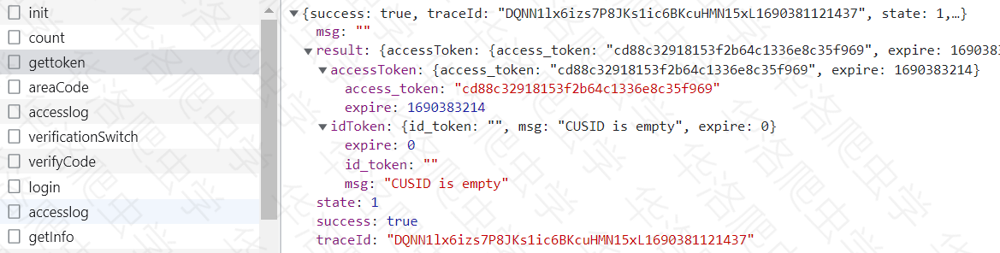

其中的access_token和id_token后续会使用到。

### verifyCode

此包作用是发送登录验证码，请求参数如下：

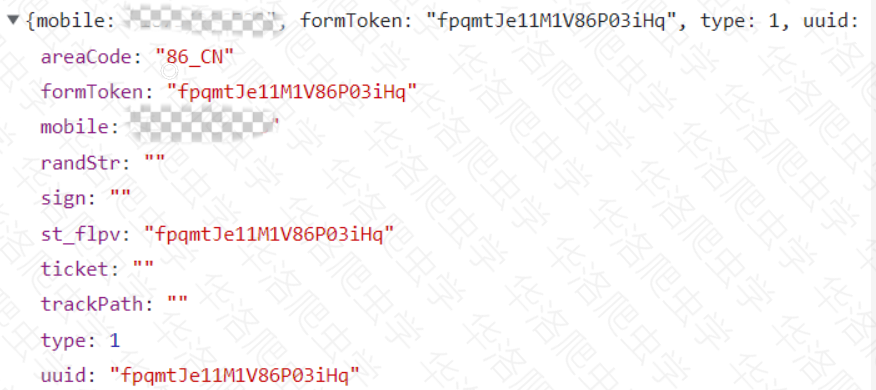

其中formToken、st_flpv、uuid均相同，且都由js生成。

### login

此包作用是用户登录，请求参数如下：

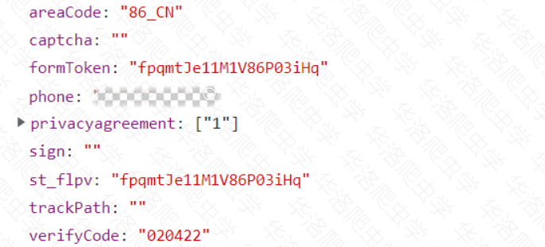

此包响应中的sign和userId后续会用到。

### list

此包作用是生成购票信息，请求参数如下：

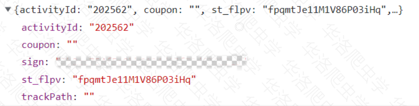

其中activityId是票id，sign是login请求返回的。

此次请求的响应中有个ticketId是票的唯一标识id，后续会使用到。

### confirm

此包作用是生成订单信息，请求参数如下：

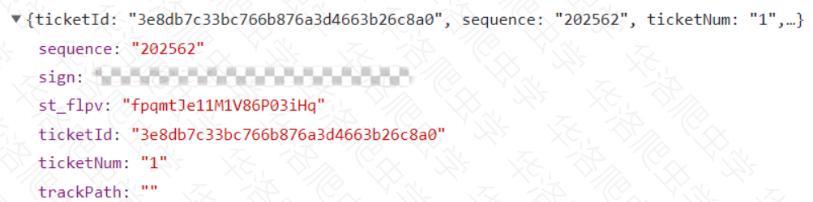

其中activityId是票id，ticketNum是购票数量。

### order

此包作用是提交订单信息，请求参数为：

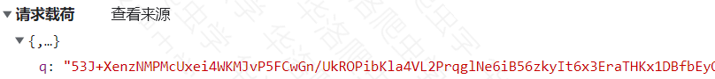

解密后的请求参数如下：

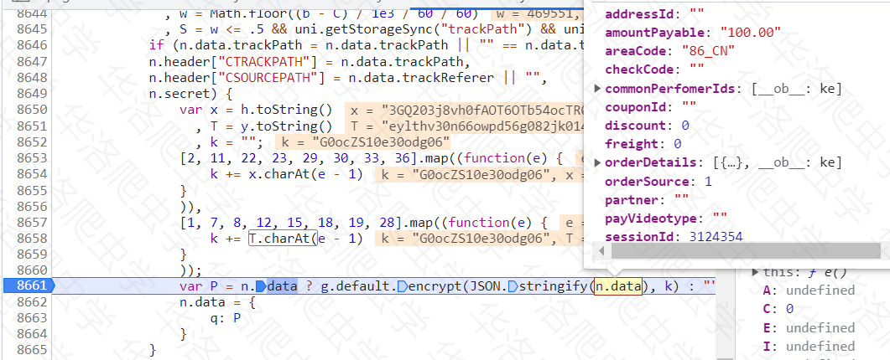

其中orderDetails里是关于票的一些基本信息，其余参数均由前所得。

### getCoreOrderResult

此包作用就是最终提交订单信息的，请求参数格式同上，解密后的请求参数如下：

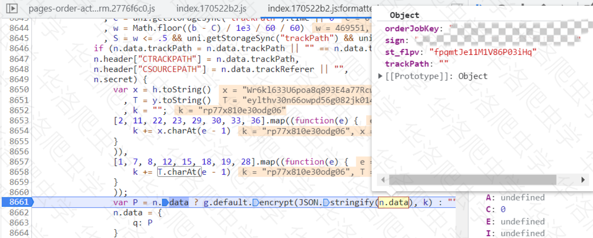

其中orderJobKey由order请求的响应得到，sign仍是通过login请求得到的那个。

## 请求头参数逆向

> 此案例中所有请求的请求头参数均不可少，这里着几个变化的参数说明，剩余参数固定即可。

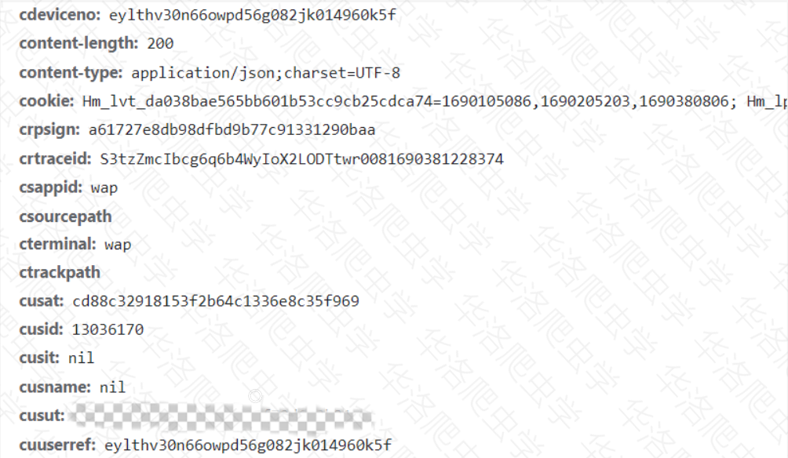

### st_flpv

直接全局搜索 st_flpv ，非常明显，后面的`this.$util.uuid()`就是，埋下断点：

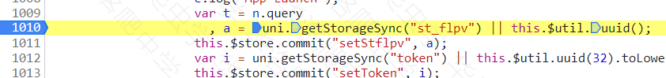

进入函数就可以看到如下加密位置了。

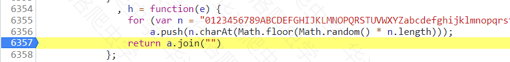

### crtraceid

同上，依旧是同一个生成方法，只不过传入参数32，加上时间戳即可。

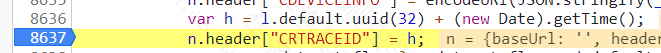

### cdeviceno/cuuserref

猜测只与当前设备有关，一般不变，可以定死。

### cusat

由首次请求`gettoken`得到，此后一直不变。

### cusit

由二次请求`gettoken`得到（需要携带之前的`sign`参数），此后一直不变。

### crpsign

直接搜索即可找到加密位置，`E` 变量显而易见，不过要注意其中的`n.url`的变化。

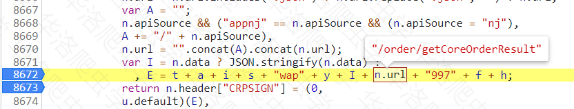

进入`u.defanlt`内部会发现是webpack结构的魔改md5算法，常规扣代码即可，完整代码稍长，就不在这里放了。

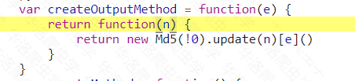

### 加密参数q

此处使用的是原生的`"crypto-js"`库实现的AES算法，可以自行在node或python下实现：

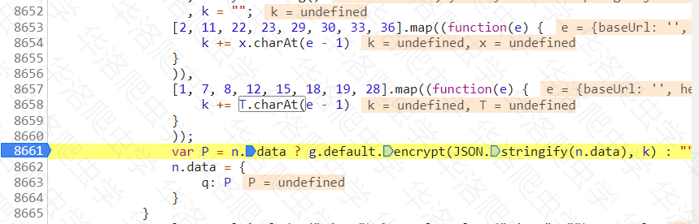

node实现：

```js
// AES加密解密
const CryptoJS = require("crypto-js");
const encrypt = function (e, n) {
    n = n || "0RGF99CtUajPF0Ny";
    const t = CryptoJS.enc.Base64,
    a = CryptoJS.enc.Utf8.parse(n),
    r = CryptoJS.enc.Utf8.parse(e),
    s = CryptoJS.AES.encrypt(r, a, {
        mode: CryptoJS.mode.ECB,
        padding: CryptoJS.pad.Pkcs7
    });
    return t.stringify(s.ciphertext);
};
const decrypt = function (e, n) {
    n = n || "0RGF99CtUajPF0Ny";
    const t = CryptoJS.enc.Utf8.parse(n),
    a = CryptoJS.AES.decrypt(e, t, {
        mode: CryptoJS.mode.ECB,
        padding: CryptoJS.pad.Pkcs7
    });
    return CryptoJS.enc.Utf8.stringify(a).toString();
};
```

# 完整代码

**以下只演示部分关键代码，不能直接运行！**完整代码仓库地址：https://github.com/kgepachong/crawler/

## JavaScript 加密

```js
var base_ = function (e) {
    for (var n = "0123456789ABCDEFGHIJKLMNOPQRSTUVWXYZabcdefghijklmnopqrstuvwxyz" + (new Date).getTime(), t = e || 20, a = [], i = 0; i < t; i++)
        a.push(n.charAt(Math.floor(Math.random() * n.length)));
    return a.join("")
}
function create_st_flpv(){
    return base_();
}
function create_crtraceid(){
    return base_(32) + (new Date).getTime();
}
function create_crpsign(t_,st_flpv,cuuserref,crtraceid,url_path,I_,sign='',userid='',id_token='') {
    var url = url_path 
    var t = t_ 
        , a = sign
        , i = id_token
        , s = userid
        , y = cuuserref 
        , I = I_ //'{"st_flpv":"' + st_flpv + '","sign":"","trackPath":""}'
        , f = "wap"
        , h = crtraceid;
    // 其有许多信息与请求头当中的相同
    var E = t + a + i + s + "wap" + y + I + url + "997" + f + h;
    return _md5(E)
}
```

## Python 请求代码演示

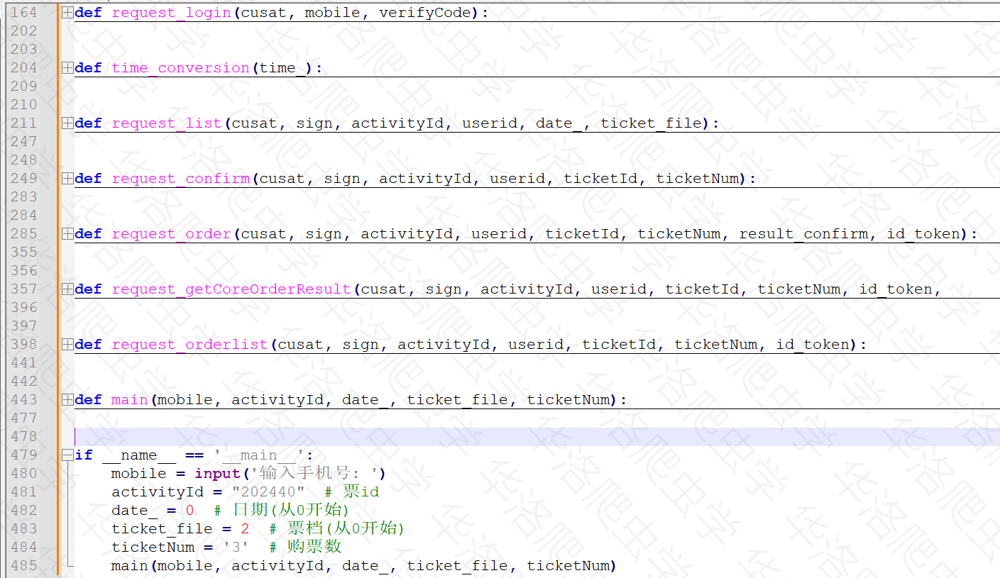

# 运行结果演示

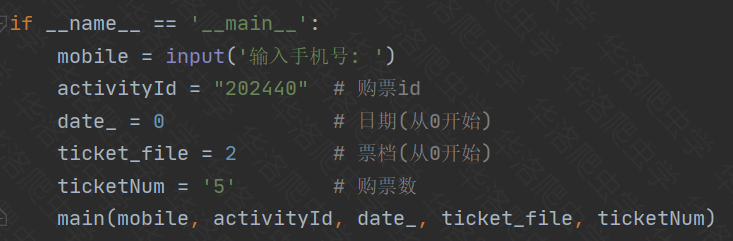

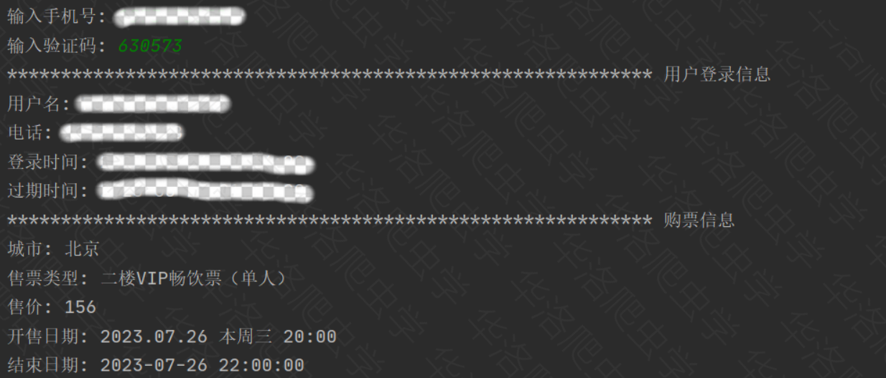

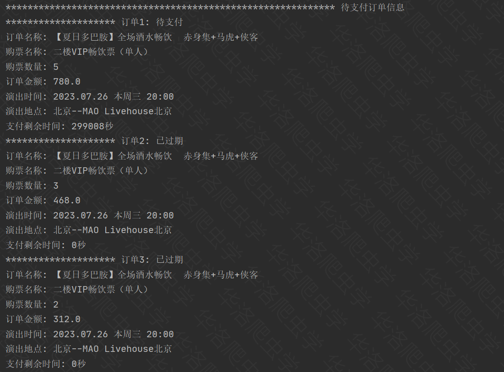

